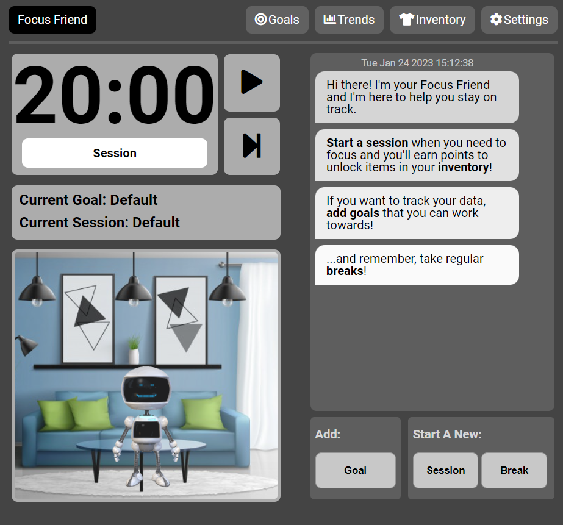
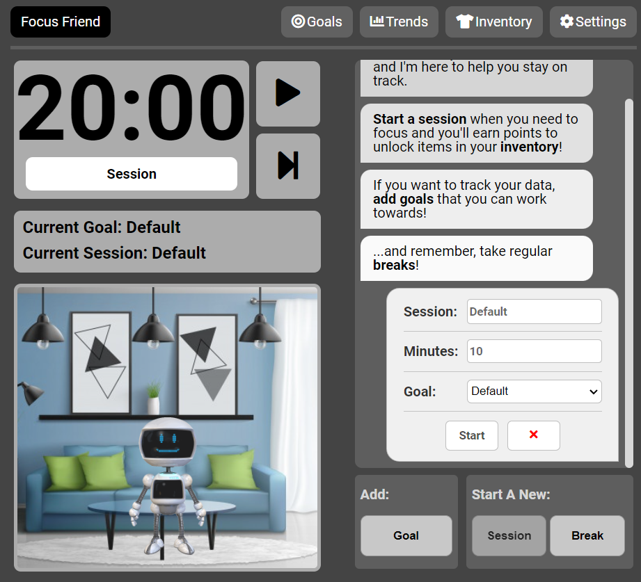
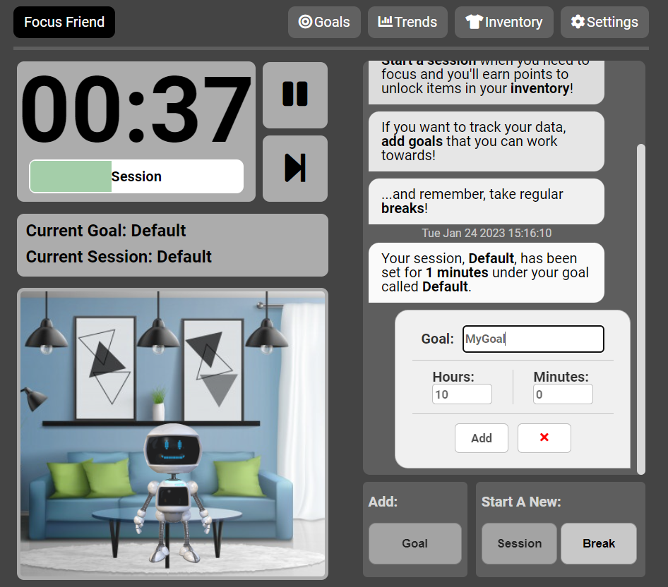
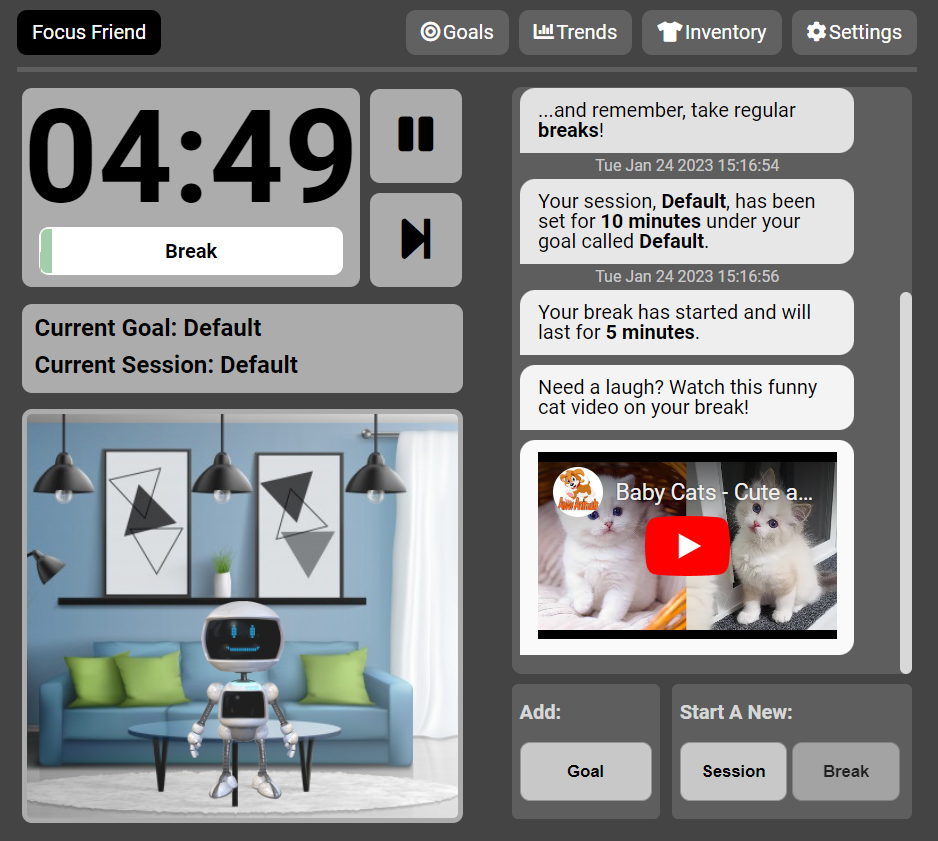
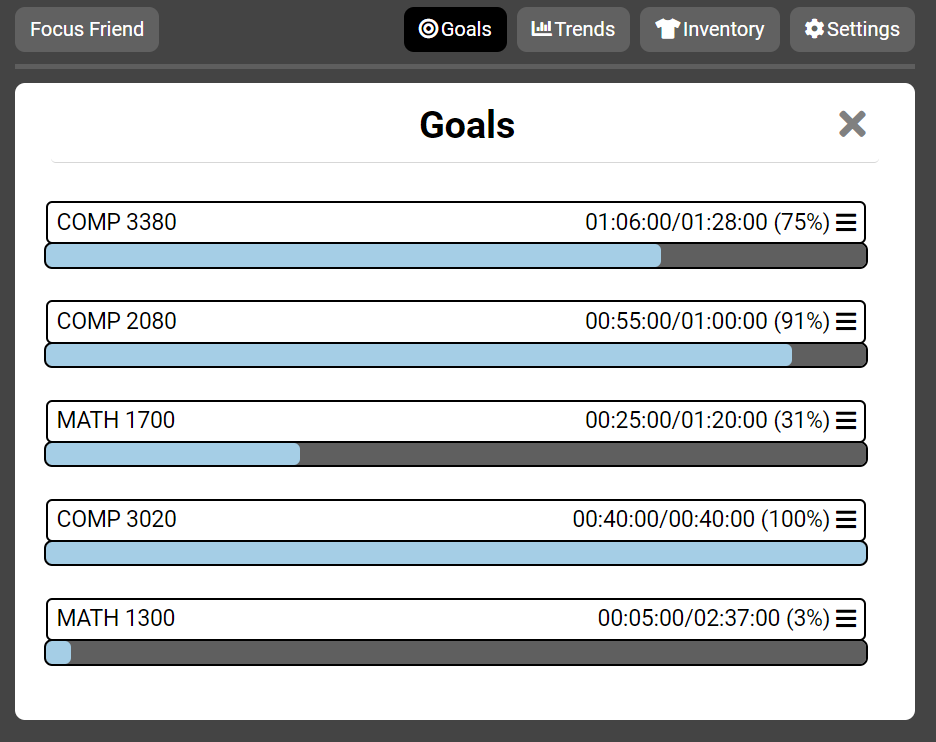
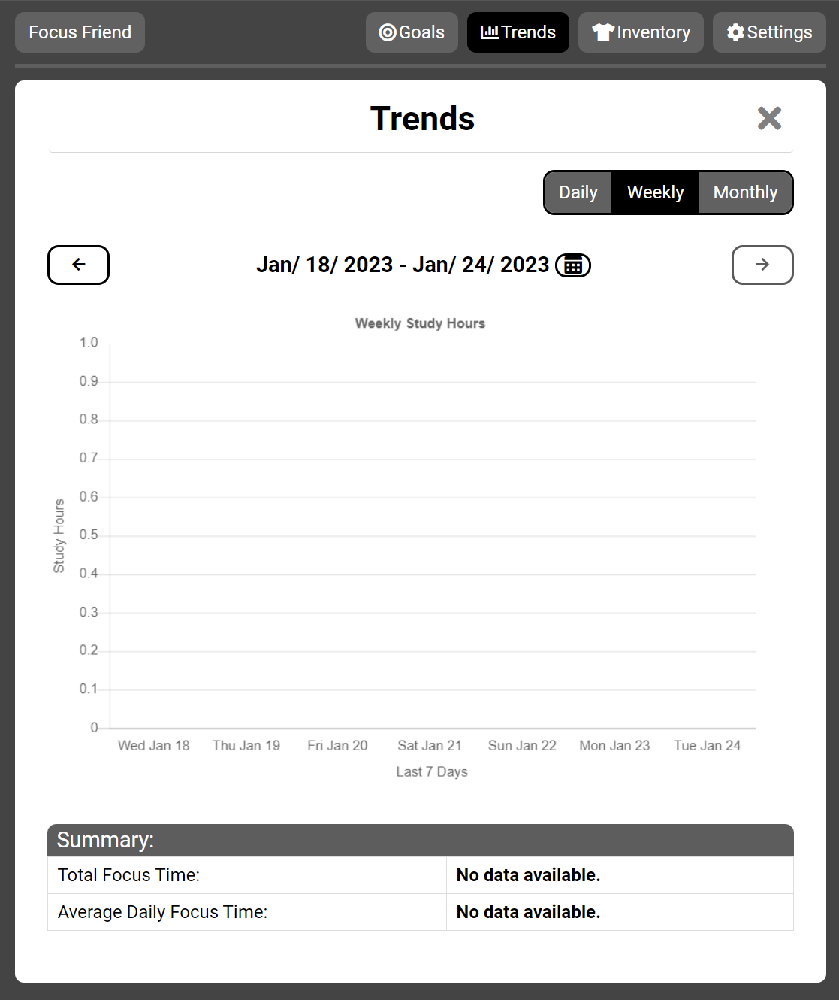
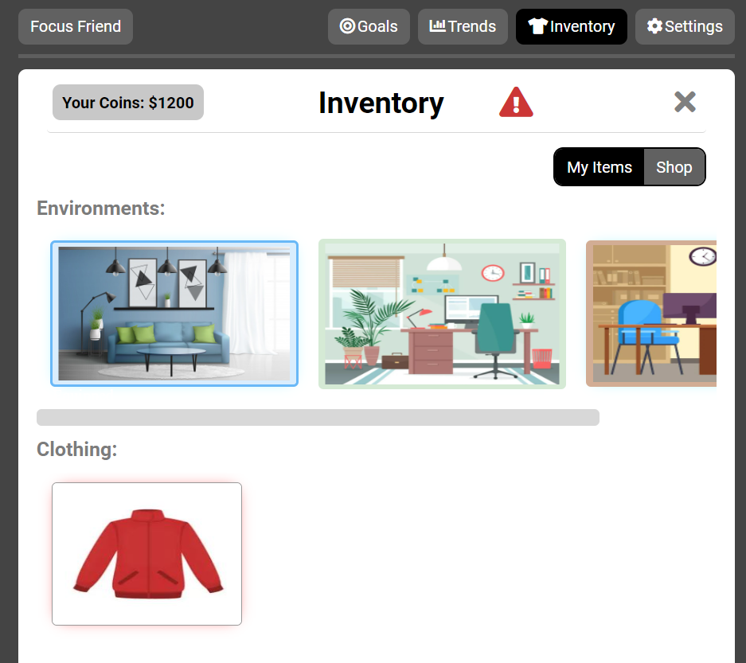
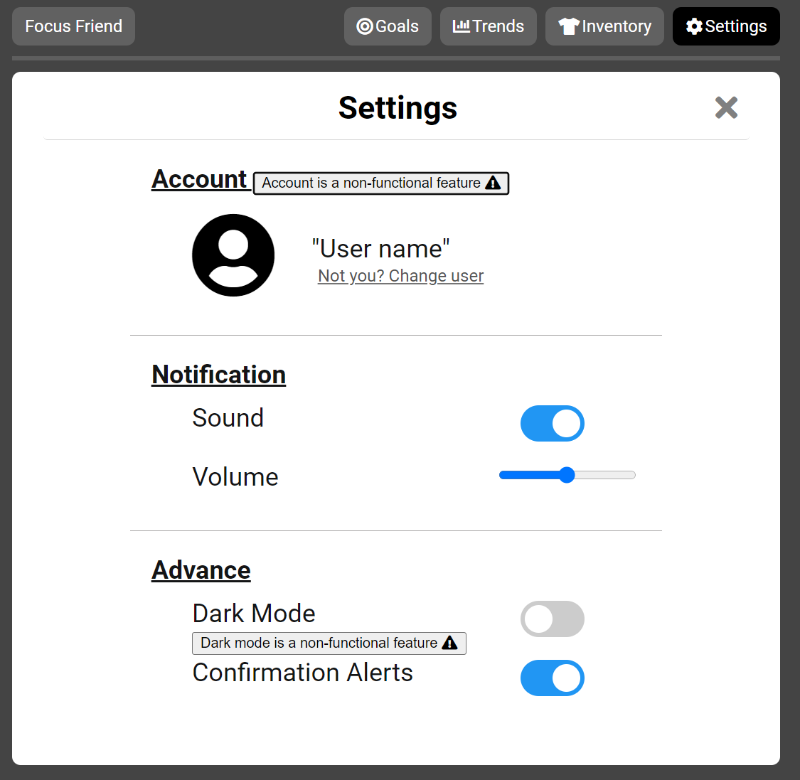

# Focus Friend
---

Study Tracking App

## Description
---
Focus Friend is a study tracking web app in the form of a personal study companion. Your customizable companion studies alongside you, keeps you on task, encourages you and helps maintain healthy habits like taking breaks.   

By using the “chat box” that connects you and your companion, you can update your companion about details of your current study session. For example, you can tell your companion what you’re working on, and it will keep you on task by giving you messages of encouragement and motivation. Once the timer is up, your companion will notify you with an audio cue. If you’ve been studying for too long, your companion will encourage you to take a break by instructing you to stretch, breathe, or watch a short video to pass the time. Your companion also lives in a virtual environment that can be upgraded using virtual currency. The more you study, the more currency you earn to spend on upgrading your companion’s living space.   

Other features of the app include a statistics page that provides you with information about your previous study sessions, a companion shop that allows you to buy upgrades for your companion, and a settings page for options such as toggling dark mode and customizing the timer.

## Overview
---

The Study Companion app was created to improve and enhance academic performance, motivate users, and promote healthy habits. The storyboard above is a representation of common problems for high school and college students – they often struggle to be engaged in their schoolwork and are easily distracted by devices such as smartphones. Smartphones are one of the most common technological devices that have become an integral part of our lives, especially for students. While this device is meant to facilitate the users' lives, it can also be a source of distraction for students, for example when used for off-task purposes like browsing the web or spending too much time on social media. When this happens, the academic performance of the student is often negatively impacted. It may be time to reassess the way we use technology and how it affects our time management. We asked ourselves, what if we could harness technology in a way that not only decreases the time wasted online but also motivates students, keeps them healthy and improves academic performance. Study Companion is a system that allows users to customize their study habits.  The app will track what the user does and will reward the user accordingly. The user will earn virtual currency as they study, and the more they study, the more coins they get. These coins can be redeemed for a variety of prizes in the Study Companion virtual store. In addition, the companion will send the user motivational messages and will let the users know when it's time for a break. The break time notification integrates active relaxation techniques for the users such as stretching or breathing exercises, meditation routines, or even funny content (videos or images) so they can disconnect from their work between tasks. 

In the same way, the app would let the users know when it is time to go back and continue working until the tasks are successfully completed. The application allows the customer to set temporary or long-term goals. The user has the ability to see a report or their work, and the application provides statistics about their study sessions and the goals reached. This option would allow the users to find the optimal study point where users don't overstudy but at the same time get the tasks completed at the right time. The app can help users to set study hours as part of their daily routine. It will remind the users of this time as a requirement – like a scheduled class, so they stay disciplined and motivated. Students and users will improve emotionally, mentally, and academically. 

## Core Functionality
---

### Main Page

---

### Start a Session

---

### Set Goal

---

### Start a Break

---
### Goals Page

---
### Trends Page

---

### Inventory Page

---

### Settings Page

